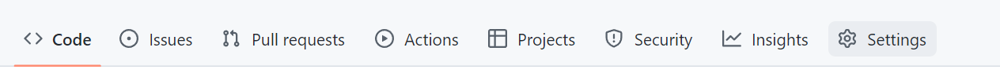
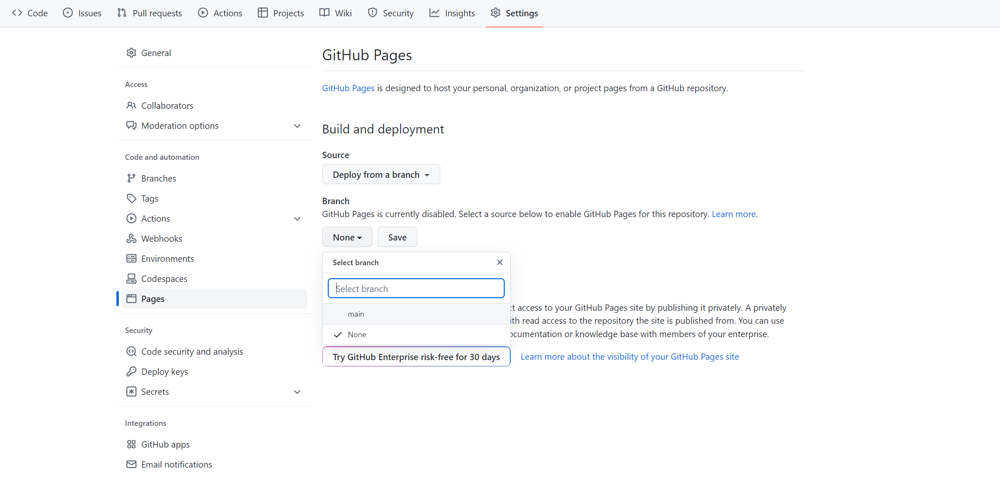
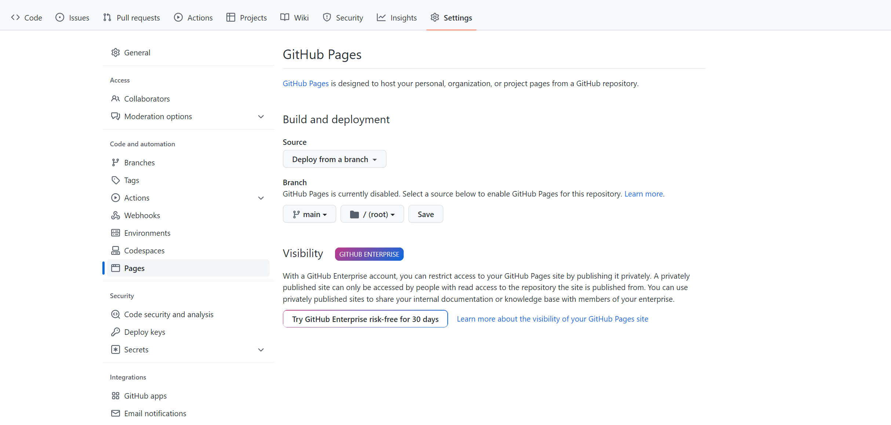
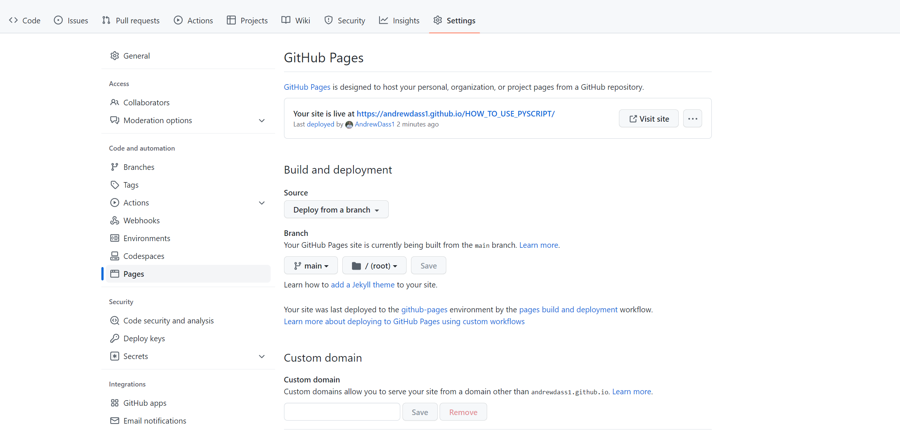
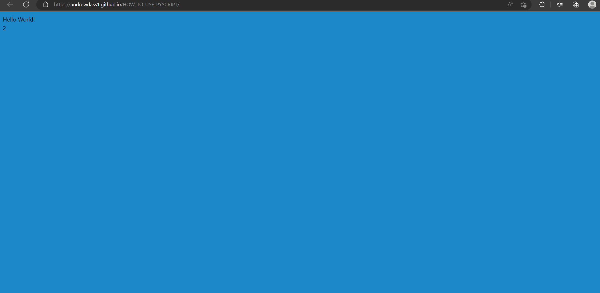

# How to use PyScript
This directory shows detailed instructions how to get started and use PyScript for HTML and Python projects on Github

## How to Incorporate PyScript in HTML
1. HTML files most basic structure are two HTML tags shown below:
```
<HTML>

</HTML>
```
Within the HTML tags, include the following source code to incorporate PyScript:
```
<HTML>
  <head>
    <link rel="stylesheet" href="https://pyscript.net/latest/pyscript.css" />
    <script defer src="https://pyscript.net/latest/pyscript.js"></script>
  </head>
</HTML>
```

2. Now, incorporate "py-script" tags in the HTML file. Within the "py-script" tags, the HTML file can read and execute code written in Python.
```
<HTML>
  <head>
    <link rel="stylesheet" href="https://pyscript.net/latest/pyscript.css" />
    <script defer src="https://pyscript.net/latest/pyscript.js"></script>
  </head>
  
  <body>
    <py-script>
      print("Hello World!")
    </py-script>
  </body>
</HTML>
```


## Procedure to Deploying PyScript Files onto the Web
1. Create a Github repository and include an "index.html" file in a directory

2. Select "Settings"
<html>
     <h1>
        
     </h1>
</html> 

3. From the sidebar to the left, select "Pages"
<html>
     <h1>
        
     </h1>
</html> 

4. Under <b>Source</b>, select "Deploy from a Branch" and under <b>Branch</b> select the branch that contains the source code. After specifying which branch has the source code, another box shows up to specify which directory the source code is located within the branch. Specify the directory that contains the source code. Afterwards, click "Save". In this demonstration, the "main" branch was selected and all the source code is in the root directory of the main branch.
<html>
     <h1>
        
     </h1>
</html> 

5. Once the branch has been deployed, the wait time is a few seconds to a minute for the website to be deployed. Refresh the page to see the change. Once finished, a link will be generated. Click on the link. 
<html>
     <h1>
        
     </h1>
</html> 
<html>
     <h1>
        
     </h1>
</html> 
